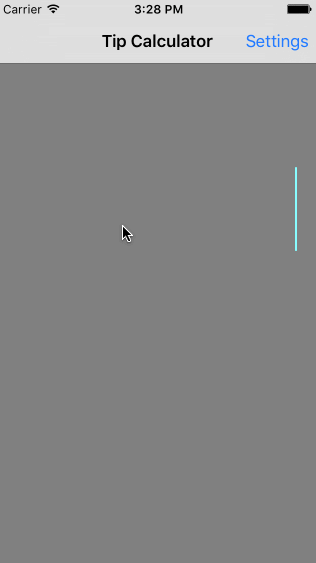

Tip Calculator
==================

This is a Tip Calculator application for iOS submitted as the pre-assignment requirement for Codepath.

Time spent: 8 hours

Completed user stories:

* [x] Required: Basic tip calculator functionality
* [x] Required: Settings page
* [x] Optional: UI animation
* [x] Optional: Remember the bill amount across app restarts (within 10 minutes)
* [x] Optional: Use locale specific currency and currency thousands separators
* [x] Optional: Use local language only English, Turkish French
* [x] Optional: Light/dark color theme in settings view

Notes: 

This only works for iPhone Retina 4" in Portrait orientation. I did not spend any time making the app look right in other screen sizes and Landscape orientation.

**Walkthrough of required and optional user stories:**

GIF created with [LiceCap](http://www.cockos.com/licecap/).

